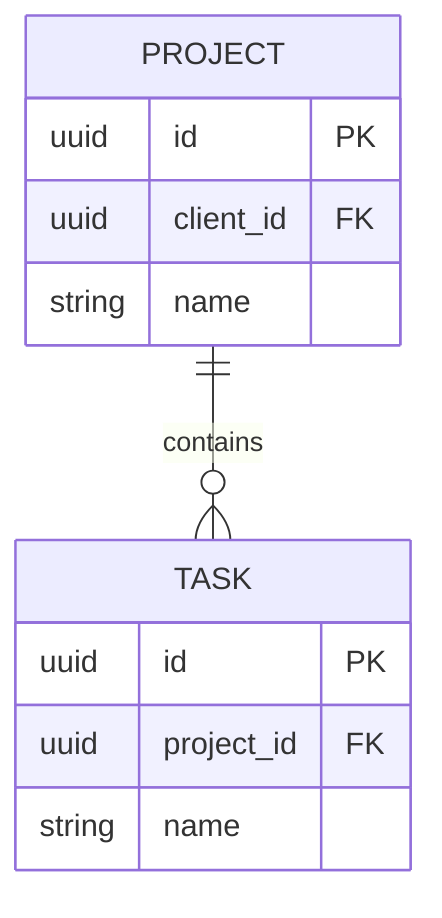

# Project

```mermaid
erDiagram
    PROJECT ||--o{ TASK : contains
    PROJECT{
        uuid id PK
        uuid client_id FK
        string name
    }
    TASK {
        uuid id PK
        uuid project_id FK
        string name
    }
```
